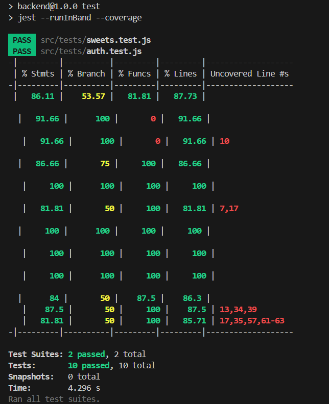

# 🍬 Sweet Shop Management System

A full-stack Sweet Shop Management System built as part of an assessment task.  
The application demonstrates clean backend architecture, Test-Driven Development (TDD), authentication & authorization, and a simple React frontend.

---

## 🚀 Live Project Status

## 📸 Project Status



> Jest test results and coverage summary for backend modules.


---

## 🛠 Tech Stack

### Backend
- **Node.js**
- **Express.js**
- **MongoDB + Mongoose**
- **JWT Authentication**
- **Jest & Supertest (TDD)**

### Frontend
- **React (Vite)**
- **React Router**
- **Axios**

---

## ✨ Key Features

### Authentication & Authorization
- User registration & login
- JWT-based authentication
- Role-based authorization (`ADMIN`, `USER`)
- Protected routes using middleware

### Sweet Management
- Admin can:
  - Add new sweets
  - Restock sweets
- Users can:
  - View available sweets
  - Purchase sweets
- Inventory management with oversell prevention

### Search & Filtering
- Search sweets by name (case-insensitive)
- Filter by category
- Filter by price range

### Testing
- Test-Driven Development (TDD)
- Unit & integration tests using Jest
- Reliable test isolation
- Tests run in serial mode for DB consistency

---

## 📂 Project Structure
Sweet-Shop-Managment/
├── backend/
│ ├── src/
│ │ ├── routes/
│ │ ├── models/
│ │ ├── middleware/
│ │ ├── tests/
│ │ └── app.js
│ └── server.js
│
├── frontend/
│ └── src/
│ ├── pages/
│ ├── context/
│ ├── api/
│ └── App.jsx
│
└── README.md


---

## ⚙️ Setup Instructions

### 1️⃣ Backend Setup

```bash
cd backend
npm install

PORT=3000
MONGO_URI=mongodb://127.0.0.1:27017/sweet-shop
JWT_SECRET=your_jwt_secret

Run backend:
npm run dev

Run tests:
npm test

Testing Approach
Tests written before implementation (TDD)
Clear separation of concerns
Database isolation between tests
Focus on business logic correctness

📌 Assumptions & Notes

JWT is stored in localStorage for simplicity
UI focuses on functionality over styling
Project prioritizes correctness, structure, and testability

🤖 AI Usage Declaration
AI tools were used as a learning and productivity aid for:

Understanding best practices
Debugging errors
Improving code clarity
All code was written, tested, and understood by me.

👤 Author
Name: Ravi Vadher
Role: Full Stack Developer
Purpose: Technical Assessment Submission